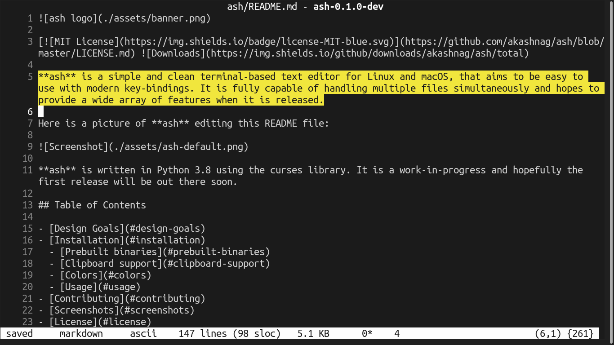

[](https://github.com/akashnag/ash/blob/master/LICENSE.md)   

**ash** is a simple and clean terminal-based text editor, that aims to be easy to use with modern key-bindings. It is capable of handling multiple files simultaneously and has a wide array of modern features. Here is a picture of **ash** editing this README file:



**ash** is written in Python 3.8 using the curses library.

## Table of Contents

- [Features](#features)
- [Requirements](#requirements)
- [Installation](#installation)
  - [Prerequisites](#prerequisites)
  - [Installing **ash**](#installing-ash)
  - [Uninstalling **ash**](#uninstalling-ash)
  - [Setting paths](#setting-paths)
- [Prebuilt binaries](#prebuilt-binaries)
- [Colors](#colors)
- [Usage](#usage)
- [Contributing](#contributing)
- [Screenshots](#screenshots)
- [License](#license)

- - -

## Features

The following is a list of features available in **ash**:

- Easy to use, clean and intuitive interface
- Common key bindings (Help on F1, Arrow keys for movement, Shift+Arrow/Home/End/PgUp/PgDown for selecting text, cut/copy/paste using Ctrl+X/C/V, undo/redo using Ctrl+Z/Y, find/replace/goto using Ctrl+F/H/G, etc.) and support for remapping key bindings to your taste
- Common editor features such as undo/redo, line numbers, find-replace, cut-copy-paste, etc.
- True support for wrapping (both hard & soft) with intuitive cursor movements along wrapped text
- Multi-file editing with support for windows and tabs
- Auto-backup
- Support for Unicode
- Project mode (opening a directory instead of individual files)
- Complete session (for projects) and undo persistence (turned on for projects opened directly from command-line)
- Live search
- Support for search/replace in **all** open files
- Support for searching using regular expressions
- Auto-indentation, Select+Tab/Shift-Tab to increase/decrease indent
- Auto insertion of matching braces/quotes and auto-enclosure when text is selected and braces/quotes are typed
- Support for unlimited splits per tab (subject to screen size) and support for unlimited tabs
- Support for various text-encodings
- Checks (live) and reloads (if user permits) files which have been modified externally
- Selection highlighting (highlights text under selection wherever they occur in the document)
- Color scheme customization
- View list of recent files, view project explorer (in project mode)
- Syntax highlighting (limited)
- Git integration (shows untracked, modified files, etc.)
- Multiple Cursors
- Command palette
- Basic mouse support
- Open terminal / execute shell commands
- Limited IDE features like compile, build, execute...
- Supports project/folder specific settings along with global settings

## Requirements

1. You need a resolution of at least 102 x 22 in your terminal emulator
1. Your terminal must support Unicode and be able to display at least 256 colors with the capability of remapping color palettes (Works best on: `xterm-256`). Monochrome terminals are also partially supported.
1. If you are running the source distribution, you need the GNU C compiler collection besides Python 3.8, as some parts of the application are written in Cython. The first time you run the application, Cython will compile and build the `*.pyx` files, which may increase load time (Ignore the warnings during compilation)

**ash is primarily targetted to Linux. This version of ash has only been tested on Ubuntu 20.04 with Python 3.8.2 (64-bit)**

## Installation

*Note: Instructions provided here are for Debian/Ubuntu based systems. For your distribution, you may need to issue different instructions to install the necessary packages.*

### Prerequisites

You need certain packages and Python 3 itself to run **ash** on your system, as there are no prebuilt binaries available yet.

```bash
$ sudo apt install git
$ sudo apt install xclip
$ sudo apt install python3
$ sudo apt install python3-pip
```

Depending on your system, you may also need to install the following packages:

```bash
$ sudo apt install python3-devel
```

### Installing ash

You have multiple options here:

- Install from PyPi **(recommended)**
- Install the latest stable release from GitHub
- Install the latest nightly release from GitHub
- Build and install from source

#### Install from PyPi

Execute the following instructions to install from PyPi:

```bash
$ sudo pip3 install ash-editor
```

The above command downloads **ash** and installs it locally on your system. To be able to invoke **ash** from anywhere, see the [Setting Paths](#setting-paths) section.

#### Install the latest stable release

**Note: the stable release may not contain all features listed above**

Go to the **ash** [Website](https://akashnag.github.io/ash) and download the latest stable release. Then extract the downloaded tar-ball into a folder and once inside that folder, open up your terminal from there and execute:

```bash
$ sudo pip3 install .
```

#### Install the latest nightly release

The nightly builds contains all the latest features of ash. Go to the **ash** [Website](https://akashnag.github.io/ash) and download the latest nightly release. Then extract the downloaded tar-ball into a folder and once inside that folder, open up your terminal from there and execute:

```bash
$ sudo pip3 install .
```

#### Build from source and install

To build from source, issue the following instructions:

```bash
$ sudo apt install git
$ cd ~
$ git clone --depth 1 -b master https://github.com/akashnag/ash.git
$ cd ash
$ python3 setup.py sdist
```

(Though you can install it directly from here, it is not recommended) You will find the new tar-ball created under `dist` directory, from where you can proceed as before by first copying the tarball into a new directory, extracting it, and then installing it.


### Setting paths

To run **ash** make sure you have `:$HOME/.local/bin` appended to your $PATH variable in the file `~/.bashrc`. To execute **ash**, see the [Usage](#usage) section.

### Uninstalling ash

To uninstall **ash** you can use:

```bash
$ sudo pip3 uninstall ash-editor
```

## Prebuilt binaries

Since **ash** is still under development, prebuilt binaries are not yet available. You can use PyInstaller or similar tools to build one for your system.

## Colors

If you are using the default Ubuntu terminal, to enable 256 make sure your `TERM` variable is set to `xterm-256color`. After **ash** runs for the first time, it creates a `default.json` JSON file inside the ~/.ash-editor/themes directory. You can edit that file directly to change how **ash** looks on your system. The RGB triplets listed in that file range from 0--255. If you want to reset **ash** to its default colors, delete the configuration file using: `rm ~/.ash-editor/themes/default.json`. The theme file defines the color names first followed by setting the foreground and the background colors of each GUI element of the app.

## Usage

Once you have downloaded the **ash** source code, and set it up as detailed above, you are ready to use it.

**NOTES:**

1. If you have not updated your path variable, you must specify the full path to the ash binary.
1. Your terminal resolution should be at least 102 (width) x 22 (height). Opening the editor in a lower resolution may unexpectedly crash the application. This requirement is necessary to properly display the dialog-boxes.

To run **ash**:

```bash
$ ash path/to/file.txt
```

or, to open an empty buffer:

```bash
$ ash
```

or, to open a project (directory):

```bash
$ ash path/to/directory
```

See the [Key Bindings](KEYBINDINGS.md) for help on how to navigate in ash.

## Contributing

### Contributing to the source code

If you find any bugs, please report them. I am also happy to accept pull requests from anyone for either bug-fixes, performance improvements, or for implementing the not-yet-implemented features listed above. Please consider contributing towards new features **only when** the features listed above have been fully implemented. For more information on what features to implement and the project structure, see the [Contribution Guidelines](CONTRIBUTING.md)

### Bug-fixes and feature enhancements

You can use the [GitHub issue tracker](https://github.com/akashnag/ash/issues) to report bugs, ask questions, or suggest new features. You can include the log if that is relevant, which can be found in `~/.ash-editor/log.txt`.

### Discussions

For discussions related to the development roadmap and the **ash** editor in general, you can join the [ash Discord Server](https://discord.gg/KErp57T6en).

### Say Thanks\!

If you are not into software development, you can still contribute financially. Financial contributions help me prioritize working on this project over others and helps me know that there is a real demand for this software.

<a href="https://www.buymeacoffee.com/nagakash"><p align="center"></p></a>


## Screenshots


## License

Copyright &copy; Akash Nag. All rights reserved.

Licensed under the [MIT](LICENSE.md) license.
